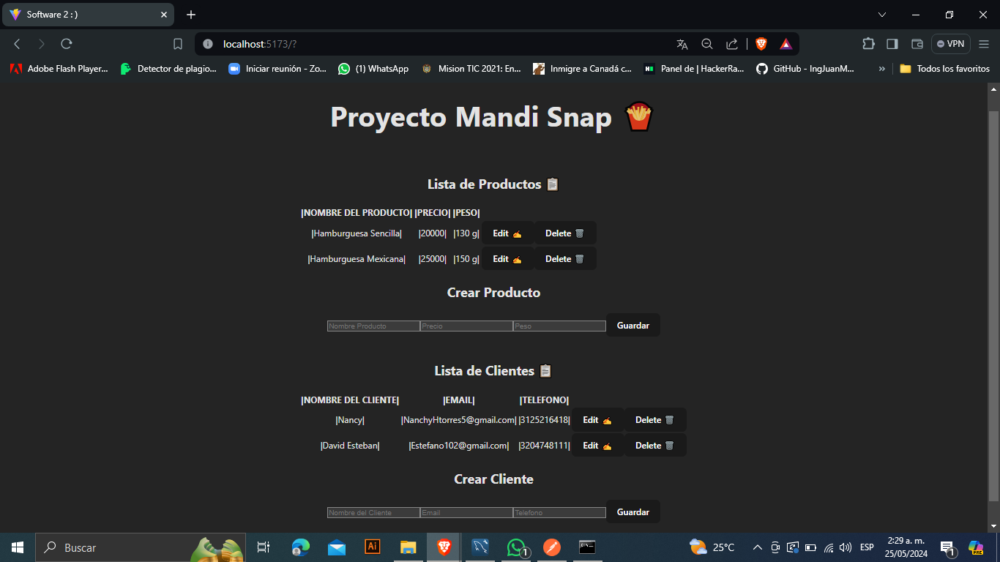
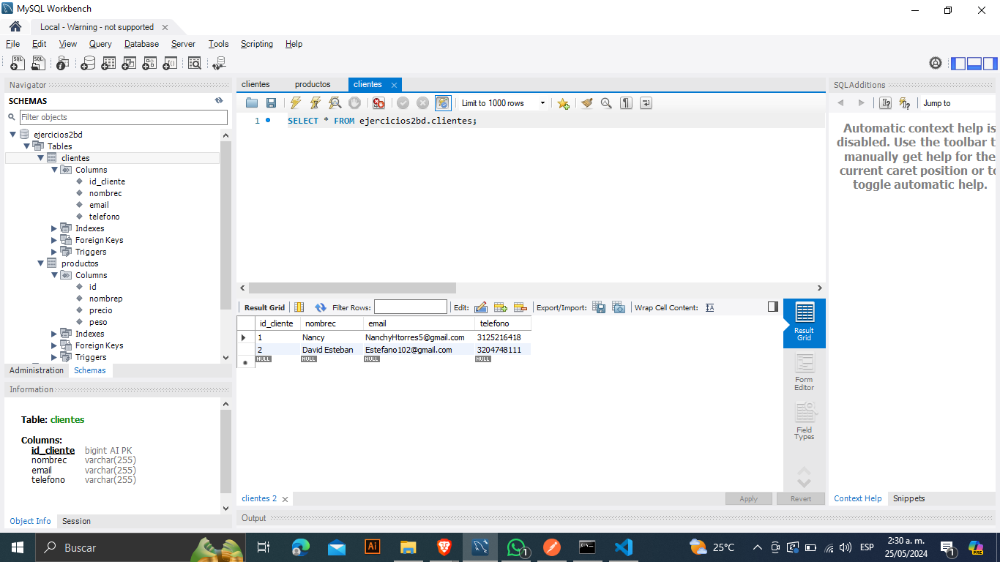
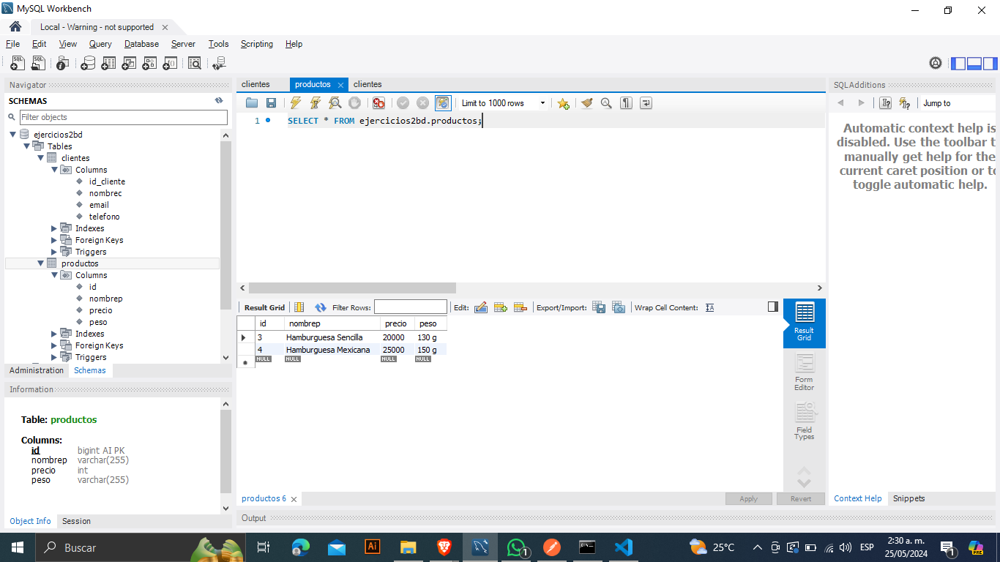

Tanto la carpeta Backend2 como la del Frontend2 tiene su README donde encontrara la informacion para ser ejecutados
Tambien se encuentra el ejecisio que se hizo en clase

Pruebas
Navegador

MySQL

Clientes

Productos

HAY ERRORES PARA GUARDAR LOS PRODUCTOS Y LOS CLIENTES

TAMBIEN HAY ERRORES PARA EDITAR LOS PRODUCTOS Y LOS CLIENTES

UNA VEZ "GUARDADO" NO ACTUALIZAN PARA PODER VISUALIZAR EN LA LISTA TANTO PRODUCTOS COMO CLIENTES

EL ELIMINAR EN LOS PRODUCTOS FUNCIONA BIEN, PERO EL DE LOS CLIENTES NO

EN FIN ME SIENTO ORGULLOSO DE HABER APRENDIDO DURANTE LAS CLASES
